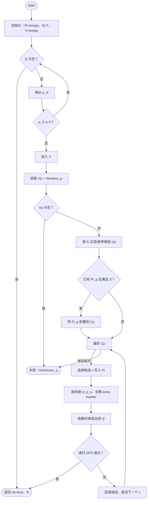

# PyHarmonyKG
基于知识图谱的依赖检测器

本文介绍 `知识图谱/flash/downstream/tasks.py` 中 **3 个下游任务（task1/task2/task3）** 的实现思路与核心求解算法。

---

## 0. 问题抽象：把“装包/升级”变成依赖约束满足

给定：

- **当前环境** `current: {package -> version}`（只包含已安装包与其版本）
- **requirements.txt 约束** `req_lines`（可视为“希望保持的兼容约束”，不是安装清单）
- **新安装目标**：单包/多包，可能是精确版本（`==x.y.z`）或范围（`>=x.y`、`~=x` 等）

目标：

- 判断是否存在一组版本选择，使得：
  - 新目标包满足其约束
  - 所有被纳入计划的包，其依赖约束都能被满足（基于 Neo4j 图谱中的 `REQUIRES` 边）
- 若允许升级（task2/task3），则输出一个**可行安装/升级计划**（plan），并标注每个包是 existing/new/upgrade。

**核心思想**：统一交给 `resolve_plan()` 做“版本选择 + 依赖展开 + 冲突回溯”。

---

## 1. 数据来源与依赖图模型（Neo4j）

`KGClient` 负责从 Neo4j 读取：

- `get_versions(name)`：返回该包的全部版本（在 Python 侧按版本排序）
- `get_requires(name, version)`：返回该版本的依赖列表：
  - 依赖包名 `dep_name`
  - 版本约束 `dep_spec`（PEP 440 specifier 字符串）
  - marker（目前实现里对包含 `extra ==` 的依赖直接跳过）

因此，图谱相当于：

- `Package(name)` 节点 + `HAS_VERSION` 到 `PackageVersion`
- `PackageVersion(name@ver)` 通过 `REQUIRES` 指向依赖 `Package`

---

## 2. 核心求解器：`resolve_plan()` 的 DFS 回溯搜索

### 2.1 输入/输出

输入：

- `current`: 现有环境 `{name: version}`
- `targets`: `[(name, spec_str, source_tag)]`

输出 `ResolutionResult`：

- `ok`: 是否找到可行解
- `plan`: `{name -> PackageSelection(name, version, source)}`，其中 `source ∈ {existing, new, upgrade}`
- `conflicts`: 不可行时的冲突原因列表（实现里通常返回 1 条“最先失败的原因”）

### 2.2 状态表示

DFS 递归的“状态”主要由三部分组成：

- **queue_state**：待处理约束队列 `[(pkg, SpecifierSet, tag)]`
  - 初始来自 targets
  - 递归过程中不断把“当前选择版本的依赖约束”追加进队列
- **plan_state**：当前已决定版本的选择表 `{pkg -> PackageSelection}`
  - 初始把 `current` 里的包填入，标记为 `existing`
- **visited**：去重集合 `set((pkg, spec_str))`
  - 同一个 `(包名, 约束字符串)` 只处理一次，避免循环依赖导致无限递归

还有两个保护阈值避免爆炸：

- `MAX_PACKAGES`：计划里包数上限（默认 800）
- `MAX_QUEUE`：队列长度上限（默认 2000）

### 2.3 版本候选集合（candidate selection）

对一个待处理条目 `(name, spec, tag)`：

1. 从 KG 取出所有版本 `versions = kg.get_versions(name)`，并排序（`sort_versions`，降序：最新在前）。
2. 构造候选列表 `cands`：
   - **无约束**（`spec` 为空）：`cands = 降序版本列表`（优先尝试最新）
   - **有约束**：筛出满足 spec 的版本，并以 **升序** 排列（实现里是对降序列表 `reversed` 后过滤）
     - 这意味着：**在存在约束时，优先尝试“更低/更保守”的可行版本**，更符合“最小升级”的直觉。
3. 若 `plan_state` 已经有该包，并且它的当前版本满足约束，则把该版本放到 `cands` 首位：
   - 直观效果：**能不动就不动**，优先保留已有版本，减少升级范围。

### 2.4 扩展依赖与回溯

对每个候选版本 `cand`：

- 复制得到 `new_plan / new_queue`
- 把 `name` 选为 `cand` 写入 `new_plan`，并按以下规则标注来源：
  - 之前没有：`new`
  - 之前是 existing 且版本不变：`existing`
  - 否则：`upgrade`
- 查询该版本依赖 `deps = kg.get_requires(name, cand)`，把每条依赖追加到队列：
  - `(dep_name, dep_spec, f"dep-of-{name}")`
  - 若 `marker` 包含 `extra ==` 则跳过（避免额外可选依赖引入不确定性）
- 递归 `dfs(new_queue, new_plan, visited)`
  - 若子问题可行，立刻返回成功（**深度优先 + 找到即停**）
  - 若不可行，尝试下一个候选版本

若所有候选都失败：返回失败原因（`"{name}: 所有候选版本依赖冲突"`）。

### 2.5 这个算法在“最小升级”上的实际表现

实现并非严格的“全局最小升级优化”（例如最小化升级包数/升级幅度的显式目标函数），但有几个**强启发式**会产生“尽量少动”的效果：

- 对已存在且满足约束的包：优先保留当前版本
- 对有约束的新选择：优先尝试满足约束的低版本（更容易兼容旧环境）
- DFS 找到一个可行解就停止（往往很快得到“第一组”可行方案）

### 2.6 算法流程图（ACL Algorithm 样式伪代码）

下面给出一个与 `resolve_plan()` / `dfs()` **一一对应**的 ACL/LaTeX Algorithm 伪代码（符号与你发的图一致：环境 \(E\)、目标约束集 \(T\)、图谱 \(G\)、方案 \(\Pi\)、冲突集合 \(C\)）。

```latex
\begin{algorithm}[t]
\caption{基于知识图谱的依赖解析算法（对应 \texttt{resolve\_plan}）}
\label{alg:kg-resolve}
\KwIn{当前环境 $E$（已安装包与版本映射）；目标安装约束集合 $T$；软件包知识图谱 $G$}
\KwOut{解析结果 $(ok, \Pi, C)$}
\BlankLine
\textbf{初始化安装方案} $\Pi \leftarrow E$；\;
\textbf{初始化待解析队列} $Q \leftarrow T$；\;
\textbf{初始化访问集合} $V \leftarrow \emptyset$；\;
\BlankLine
\Fn{\textsc{DFS}$(Q, \Pi, V)$}{
    \If{$Q=\emptyset$}{\Return $(true,\Pi,\emptyset)$}
    从 $Q$ 中取出一个约束 $(p,S)$；\;
    \If{$(p,S)\in V$}{\Return \textsc{DFS}$(Q,\Pi,V)$}
    将 $(p,S)$ 加入 $V$；\;
    从图谱 $G$ 中获取包 $p$ 的版本集合 $V_p$；\;
    \If{$V_p=\emptyset$}{\Return $(false,\Pi,\{\textsc{NoVersion}(p)\})$}
    根据约束 $S$ 过滤并排序得到候选版本集合 $\mathcal{C}_p$；\;
    \If{$p\in \Pi$ 且 $\Pi[p] \models S$}{将 $\Pi[p]$ 前置到 $\mathcal{C}_p$（优先保留现有版本）}
    \ForEach{$v \in \mathcal{C}_p$}{
        临时将 $(p,v)$ 写入方案 $\Pi$；\;
        从 $G$ 中获取 $(p,v)$ 的依赖集合 $\mathcal{D}(p,v)$（忽略含 \texttt{extra==} 的 marker）；\;
        将 $\mathcal{D}(p,v)$ 中的依赖约束追加到队列 $Q$；\;
        $(ok,\Pi',C') \leftarrow$ \textsc{DFS}$(Q,\Pi,V)$；\;
        \If{$ok=true$}{\Return $(true,\Pi',\emptyset)$}
        回滚当前版本选择；\;
    }
    \Return $(false,\Pi,\{\textsc{Conflict}(p)\})$；\;
}
\BlankLine
$(ok,\Pi,C) \leftarrow$ \textsc{DFS}$(Q,\Pi,V)$；\;
\Return $(ok,\Pi,C)$；\;
\end{algorithm}
```

如果你的 Markdown 渲染器支持 Mermaid（Typora/部分平台可开），也可以用下面这个**流程图版**（逻辑同上，便于展示“队列 + 回溯”）：



---

## 3. 三个 Task 的差异：如何构造 `targets`

三者最终都调用同一个 `resolve_plan()`，差别在于：

- 是否把 `requirements.txt` 约束作为“硬约束”纳入求解
- 是只做冲突检测，还是允许通过升级来修复冲突
- 是单包还是多包目标

下面按函数解释。

---

## 4. task1：`task1_check_single()`（只检测冲突，不做升级规划）

入口：

- `new_pkg` + `spec`（通常是精确版本或范围，但该 task 的语义是“检查是否冲突”）

关键逻辑：

1. 解析 `req_lines` 得到 `req_map: {name -> spec_str}`
2. 把 `current` 合并到 `merged`
3. 对 `requirements.txt` 中的每条约束：
   - 若该包 **已安装** 且 **不满足** requirements 约束：直接判定冲突并返回
     - 也就是说：task1 **不尝试升级** 来修复 requirements 冲突
   - 否则，把包名放入 `merged`（但如果不在 current 中，版本设为 None，后续会过滤掉）
4. 构造目标：
   - `targets = [(new_pkg, spec, "target")]`
5. 调用：
   - `resolve_plan(kg, current_only, targets)`
   - 注意：这里传给 `resolve_plan` 的 current 会过滤掉 `None`，因此实际上 **只保留已安装的包** 作为 initial plan。

结果解释：

- `ok=True`：存在一种安装新包版本的方式，使依赖闭包内不冲突，并且当前 requirements 中已安装包也没有先验冲突
- `ok=False`：要么 requirements 中已安装包先验不满足，要么新包/依赖无法满足

---

## 5. task2：`task2_install_single_with_upgrade()`（单包安装，允许升级）

入口：

- `new_pkg` + `min_spec`（常见为 `>=x.y`，语义是“至少这个版本”）

关键逻辑：

1. 解析 `req_lines` 得到 `req_map`
2. `merged = current`
3. 构造 `targets`：
   - 先放入新包目标：`(new_pkg, min_spec, "target")`
   - 再把 requirements 约束**有选择地**加入 targets：
     - 仅当 `k in merged`（即这个包当前环境里确实安装了）
     - 且该 requirements 行有版本约束 `s`
     - 才追加 `(k, s, "req")`

这段“只对已安装包施加 requirements 约束”的注释非常关键：避免把整个 requirements 当成“必须安装的包列表”，否则会导致队列膨胀、搜索空间爆炸。

因此 task2 的语义更像：

- 我想装/升级一个新包到某个下界版本
- 同时尽量保持当前环境中已安装包满足 requirements 的版本范围（必要时允许升级）

输出计划里会标识哪些包是 upgrade/new。

---

## 6. task3：`task3_install_multi_with_upgrade()`（多包安装，允许升级）

入口：

- `new_pkgs: List[(name, spec)]`（多个新包目标，通常是多个 `>=`）

关键逻辑与 task2 基本一致，只是 targets 初始变为多个：

- `targets = [(pkg1, spec1, "target"), (pkg2, spec2, "target"), ...]`
- 同样只对“当前已安装且在 requirements 有约束”的包追加 `(k, s, "req")`
- 调用 `resolve_plan(kg, merged, targets)`

由于多目标并行，队列里会更快出现“多源约束”对同一包的叠加，从而更容易触发回溯。

---

## 7. 一个简单的执行流程示意（概念图）

以 task2 为例：

1. 初始队列：`[(fastapi, >=0.110.0), (pydantic, ==1.10.9)]`（假设 pydantic 在 current 中且 requirements 约束它）
2. 弹出 fastapi，选一个候选版本，展开依赖，例如加入：
   - `(starlette, >=0.36.0)`, `(typing-extensions, >=4.8.0)` ...
3. 弹出 pydantic，若已装版本不满足，则 DFS 会尝试换一个满足 `==1.10.9` 的版本（若图谱可用），并继续展开其依赖
4. 当某个包出现多条约束（例如同时来自多个上游依赖），会在不同 DFS 分支中通过“选不同版本”来尝试满足所有约束
5. 如果所有候选都无法满足，回溯到上一个决策点换版本

---

## 8. 重要实现细节与局限

- **Marker 处理**：目前仅跳过 `extra ==` 的依赖；其他 marker（如 python_version、platform）没有被求值，会带来“过严/过松”的可能。
- **约束合并**：队列条目是 `(name, spec)` 粒度去重，而不是把同名包的多个 spec 做交集合并；因此同一包可能在不同 DFS 路径中重复处理，靠 `visited` 做了一定抑制，但不是最强的约束传播（constraint propagation）。
- **“最小升级”非严格最优**：这是一个带启发式的可行性搜索（first-feasible DFS），不保证全局最小升级代价最优解。
- **性能保护**：`MAX_QUEUE/MAX_PACKAGES` 主要是为防止图谱太大或约束太松导致爆炸。

